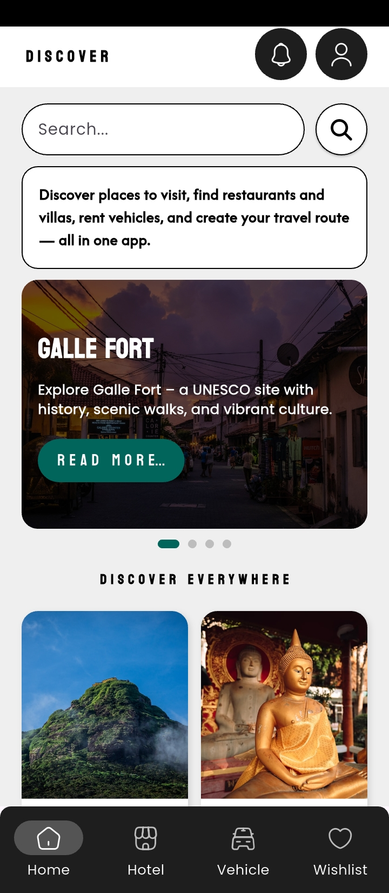
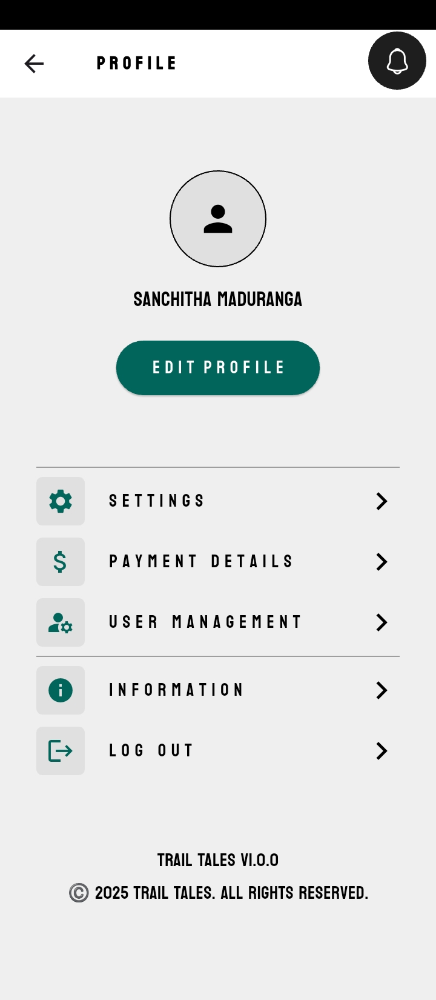

# 🌍 Trail Tales – Travel Guide Mobile App (UI Prototype)

**Trail Tales** is a Flutter-based mobile application prototype designed to simplify travel planning by combining destinations, accommodation, and vehicle rentals into one platform.

> This project focuses mainly on **UI/UX design** with **partial backend integration using Firebase**.

---

## 📱 UI Preview

## 📱 UI Preview

  
  
  

  
  
  
  

---

## 🚀 Implemented Features

- 🔐 User Login & Signup (Firebase Authentication)
- 🔑 Google Authentication
- 🎨 Fully designed Flutter UI
- 🧭 App navigation & screen flow
- 🔎 Search and category-based UI layouts

---

## 🚧 Features in Progress / UI Only

- 🏨 Hotel booking system
- 🚗 Vehicle rental system
- ❤️ Favorites & booking history
- 📍 Personalized recommendations
- 🔄 Full Firestore CRUD integration

---

## 🧠 Project Objective

Many travelers rely on multiple apps for:
- Places to visit
- Accommodation
- Transport

**Trail Tales** aims to unify these features into a **single mobile app**, starting with a strong UI foundation and scalable architecture.

---

## 🛠️ Tech Stack

- **Frontend:** Flutter (Dart)
- **Backend:** Firebase Authentication (partial)
- **Database:** Cloud Firestore (planned)
- **UI Design:** Figma
- **Tools:** Android Studio, VS Code

---

## 🧪 Project Status

🟡 **Current Stage:**  
UI Complete + Authentication Implemented  

🟢 **Future Scope:**  
Full backend integration, real-time data, AI-based recommendations, multi-language support.

⭐ This project demonstrates UI/UX skills, app architecture planning, and Firebase authentication.

